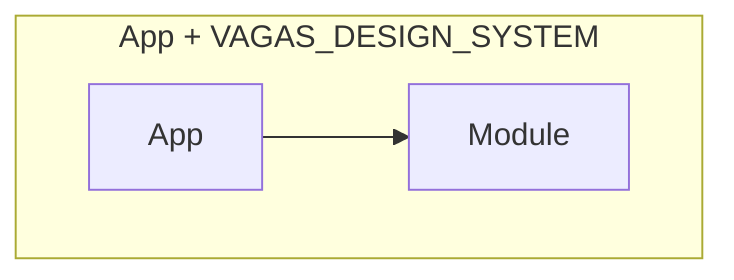

# Introdução
O módulo `VAGAS_DESIGN_SYSTEM` é responsável por reunir e disponibilizar componentes visuais comuns entre demais módulos na aplicação. Este módulo reúne os componentes, arquivos de configuração de temas e responsividade.

# Instalação
Para instalar o Módulo `VAGAS_DESIGN_SYSTEM` basta seguir os seguintes passos:
1.	Importar o pacote `VAGAS_DESIGN_SYSTEM` no arquivo `pubspec.yaml` do seu projeto. 
    ``` yaml
    vagas_design_system:
    # path: ../../VAGAS_FLUTTER_DESIGN_SYSTEM/    #Para trabalhar com o pacote localmente.
    git:
      url: https://github.com/elite37oficial/VAGAS_FLUTTER_DESIGN_SYSTEM
      ref: main
    ```
2.	Rodar o comando `Get Packages` do flutter.
3.	Importar o pacote `VAGAS_DESIGN_SYSTEM` nos arquivos `.dart` que deseja utilizar os componentes `VAGAS_DESIGN_SYSTEM`.


=======  
O pacote `VAGAS_DESIGN_SYSTEM` reúne os componentes visuais, arquivos de configuração de temas e cores, imagens, páginas e pacotes.  
Criado em: 03/2023


Dependências Internas
=============================

Dependências Externas
==========
* Flutter SDK: 3.0.0
* Font Awesome Flutter: 10.4.0
* Auto Size Text: 3.0.0
* Flutter Svg: 1.1.6

Recursos — Referências de API
========
### Themes
* App Colors: `package:vagas_design_system/src/themes/app_colors.dart` Abstração das cores para serem utilizadas na aplicação.
* App Themes: `package:vagas_design_system/src/themes/app_themes.dart` Abstração dos temas para serem utilizadas na aplicação.
* App Images: `package:vagas_design_system/src/themes/app_images.dart` Abstração dos caminhos dos imagens para serem utilizadas na aplicação.

### Packages
* Font Awesome Flutter: `package:font_awesome_flutter/font_awesome_flutter.dart` Pacote responsável pelas fontes e ícones utilizados na aplicação.
* Auto Size Text: `package:auto_size_text/auto_size_text.dart` Pacote responsável pela responsividade dos textos utilizados na aplicação.
* Flutter Svg: `package:flutter_svg/flutter_svg.dart` Pacote responsável pela renderização dos arquivos SVGs utilizados na aplicação.

### Widgets
* Responsive Text Widget: `package:vagas_design_system/src/widgets/texts/responsive_text_widget.dart` Componente responsável pela responsividade de textos na aplicação.
* Filled Button Widget: `package:vagas_design_system/src/widgets/buttons/filled_button_widget.dart` Botão preenchido.
* Outlined Button Widget: `package:vagas_design_system/src/widgets/buttons/outlined_button_widget.dart` Botão com Borda destacada.
* Page Button Widget: `package:vagas_design_system/src/widgets/buttons/page_button_widget.dart` Botao de paginação.
* Social Circle Button Widget: `package:vagas_design_system/src/widgets/buttons/social_circle_button_widget.dart` Botão de Mídias Sociais.
* Top Bar Web Widget: `package:vagas_design_system/src/widgets/app_bar/top_bar_web_widget.dart` Componente responsável pela TopBar da aplicação web.
* App Web Field Widget: `package:vagas_design_system/src/widgets/fields/app_web_field_widget.dart` Componente responsável pelo Campo de Texto da aplicação web.
* Error PopUp Widget: `package:vagas_design_system/src/widgets/popups/error_popup_widget.dart` Componente responsável pelo PopUp Simples de Erros da aplicação web.
* Success PopUp Widget: `package:vagas_design_system/src/widgets/popups/success_popup_widget.dart` Componente responsável pelo PopUp Simples de Sucesso da aplicação web.
* Success Action PopUp Widget: `package:vagas_design_system/src/widgets/popups/success_action_popup_widget.dart` Componente responsável pelo PopUp de Ação de Sucesso da aplicação web.

### Pages
* Loading Page: `package:vagas_design_system/src/pages/loading_page.dart` Página de carregamento padrão.
* Error Page: `package:vagas_design_system/src/pages/error_page.dart` Página de Erro padrão.